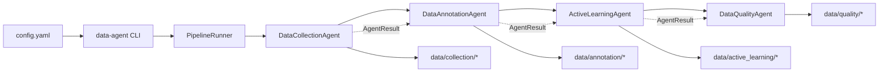

# data-agent

Local multi-stage data pipeline with agent components for collection, annotation, active learning, and quality checks.

## What this repo does

The project defines agent stages that can be run sequentially through a CLI pipeline:

- `DataCollectionAgent`: collect + normalize rows from configured sources.
- `DataAnnotationAgent`: produce annotation artifacts, confidence/review flags, and Label Studio export payloads.
- `ActiveLearningAgent`: orchestrate deterministic split + CodeAgent-driven training + epoch loss reporting.
- `DataQualityAgent`: detect/fix data quality issues and persist cleaned outputs.

Pipeline handoff is done through `AgentResult` payloads and artifact paths.

## Local launch flow

### 1) Clone

```bash
git clone <YOUR_REPO_URL>
cd data-agent
```

### 2) Create environment and install

```bash
python3.11 -m venv .venv
source .venv/bin/activate
python -m pip install --upgrade pip
python -m pip install -e .
```

### 3) Configure

Edit `config.yaml`:

- `llm.base_url`, `llm.model`, `llm.api_key`
- `agents.*` settings
- `sources` list

Important:
- Do not commit real API tokens. Use env vars or local-only config values.
- If you already committed a token, rotate it.

### 4) Launch from CLI

```bash
source .venv/bin/activate
MPLCONFIGDIR=/tmp/mpl data-agent --config config.yaml --output-dir data
```

Optional preview:

```bash
MPLCONFIGDIR=/tmp/mpl data-agent --config config.yaml --print-head 5
```

CLI args:

- `--config`: config file path (default `config.yaml`)
- `--output-dir`: artifact root (default `data`)
- `--print-head N`: print first `N` rows after run

## Current runner behavior

`cli.py` controls which stages are active in `build_runner()`.

At the moment, only the `active_learning` stage is enabled in the default CLI path, and collection/quality/annotation lines are commented out.

If you want full sequential flow, enable those blocks in `build_runner()`.

## Architecture



### Core abstractions

- `BaseAgent`: each stage implements `execute(payload) -> AgentResult`
- `AgentResult`: dataframe + schema + metrics + artifacts + logs + metadata
- `PipelineRunner`: runs a list of agents sequentially, passing prior result as next payload

### Data flow (conceptual)

1. Collection stage writes unified dataset
2. Annotation stage writes labeled/review artifacts
3. Active learning stage consumes labeled rows, creates train/val/pool, runs training orchestration
4. Quality stage validates/fixes and writes cleaned outputs

### Active learning design (current)

- Deterministic split (`random_seed`, stratified by target column)
- Script/code generation and execution delegated to CodeAgent
- Metrics must include per-epoch `loss_history`
- Report plots `train_loss` and `val_loss` against `epoch`

## Repository layout

```text
agents/
  base.py
  pipeline.py
  data_collection/
  data_annotation/
  active_learning/
  data_quality/
models/
cli.py
config.yaml
tests/
```

## Outputs

Under `data/` (or your `--output-dir`):

- `collection/`
- `annotation/`
- `active_learning/`
- `quality/`

Typical active-learning artifacts:

- `train.jsonl`, `val.jsonl`, `pool.jsonl`
- `training_job_config.json`
- `training_metrics.json`
- model artifact (`model_path` from config)
- `active_learning_curve.png`

## Development workflow

Install dev deps:

```bash
python -m pip install -e ".[dev]"
```

Run tests:

```bash
pytest -q
```

Run a file-level syntax check quickly:

```bash
python -m py_compile agents/active_learning/active_learning_agent.py
```

## Troubleshooting

### `target_column` is wrong in training config

If `training_job_config.json` shows an unexpected target, check `agents.active_learning.target_column` in `config.yaml`.

### CodeAgent import errors (authorized modules)

The executor only allows modules listed in `additional_authorized_imports` in active-learning code.

### Missing dependencies inside runtime

Install project dependencies in the same environment used to launch CLI.

## README best-practice notes for this repo

- Keep quickstart command-first and copy-paste safe.
- Document defaults and current behavior (especially staged pipeline toggles).
- Call out secrets handling explicitly.
- Keep artifact paths and config keys versioned with code changes.
- Prefer small, concrete troubleshooting entries over long prose.
